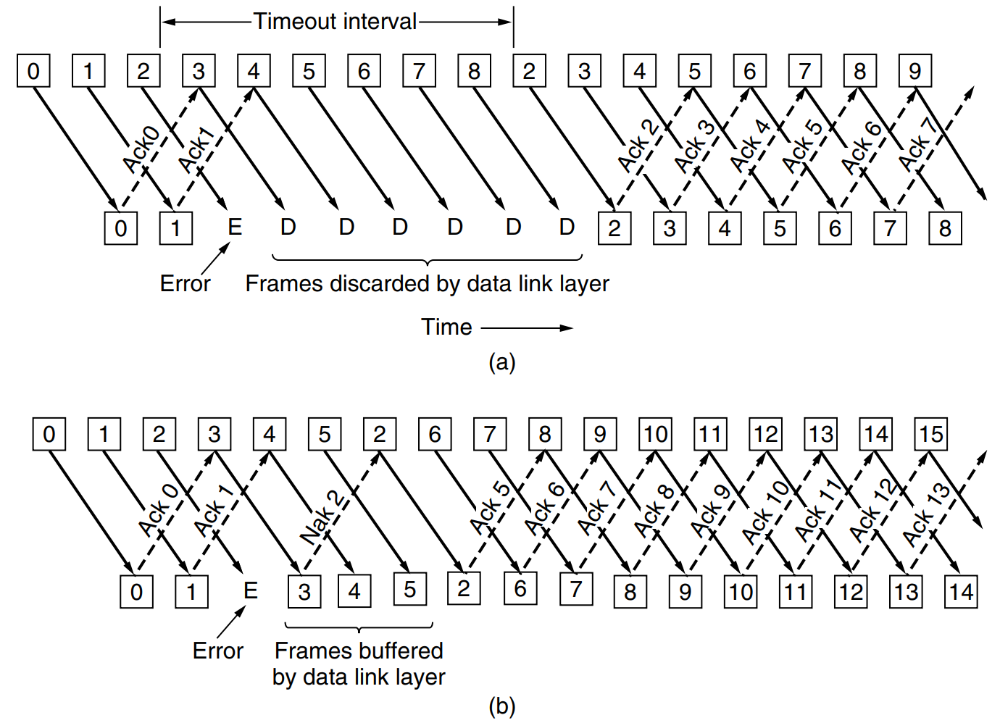

### 3.4.2 A Protocol Using Go-Back-N

Until now we have made the tacit assumption that the transmission time required for a frame to arrive at the receiver plus the transmission time for the acknowledgement to come back is negligible. Sometimes this assumption is clearly false. In these situations the long round-trip time can have important implications for the efficiency of the bandwidth utilization. As an example, consider a 50-kbps satellite channel with a 500-msec round-trip propagation delay. Let us imagine trying to use protocol 4 to send 1000-bit frames via the satellite. At $t = 0$ the sender starts sending the first frame. At $t = 20$ msec the frame has been completely sent. Not until $t = 270$ msec has the frame fully arrived at the receiver, and not until $t = 520$ msec has the acknowledgement arrived back at the sender, under the best of circumstances (of no waiting in the receiver and a short acknowledgement frame). This means that the sender was blocked 500/520 or 96% of the time. In other words, only 4% of the available bandwidth was used. Clearly, the combination of a long transit time, high bandwidth, and short frame length is disastrous in terms of efficiency.

The problem described here can be viewed as a consequence of the rule requiring a sender to wait for an acknowledgement before sending another frame. If we relax that restriction, much better efficiency can be achieved. Basically, the solution lies in allowing the sender to transmit up to $w$ frames before blocking, instead of just 1. With a large enough choice of $w$ the sender will be able to continuously transmit frames since the acknowledgements will arrive for previous frames before the window becomes full, preventing the sender from blocking.

To find an appropriate value for $w$ we need to know how many frames can fit inside the channel as they propagate from sender to receiver. This capacity is determined by the bandwidth in bits/sec multiplied by the one-way transit time, or the **bandwidth-delay product** of the link. We can divide this quantity by the number of bits in a frame to express it as a number of frames. Call this quantity $BD$. Then $w$ should be set to $2BD + 1$. Twice the bandwidth-delay is the number of frames that can be outstanding if the sender continuously sends frames when the round-trip time to receive an acknowledgement is considered. The “+1” is because an acknowledgement frame will not be sent until after a complete frame is received.

For the example link with a bandwidth of 50 kbps and a one-way transit time of 250 msec, the bandwidth-delay product is 12.5 kbit or 12.5 frames of 1000 bits each. $2BD + 1$ is then 26 frames. Assume the sender begins sending frame 0 as before and sends a new frame every 20 msec. By the time it has finished sending 26 frames, at $t = 520$ msec, the acknowledgement for frame 0 will have just arrived. Thereafter, acknowledgements will arrive every 20 msec, so the sender will always get permission to continue just when it needs it. From then onwards, 25 or 26 unacknowledged frames will always be outstanding. Put in other terms, the sender’s maximum window size is 26.

For smaller window sizes, the utilization of the link will be less than 100% since the sender will be blocked sometimes. We can write the utilization as the fraction of time that the sender is not blocked:

$$\text{link utilization} \le \frac{w}{1 + 2BD}$$

This value is an upper bound because it does not allow for any frame processing time and treats the acknowledgement frame as having zero length, since it is usually short. The equation shows the need for having a large window $w$ whenever the bandwidth-delay product is large. If the delay is high, the sender will rapidly exhaust its window even for a moderate bandwidth, as in the satellite example. If the bandwidth is high, even for a moderate delay the sender will exhaust its window quickly unless it has a large window (e.g., a 1-Gbps link with 1-msec delay holds 1 megabit). With stop-and-wait for which $w = 1$, if there is even one frame’s worth of propagation delay the efficiency will be less than 50%.

This technique of keeping multiple frames in flight is an example of **pipelining**. Pipelining frames over an unreliable communication channel raises some serious issues. First, what happens if a frame in the middle of a long stream is damaged or lost? Large numbers of succeeding frames will arrive at the receiver before the sender even finds out that anything is wrong. When a damaged frame arrives at the receiver, it obviously should be discarded, but what should the receiver do with all the correct frames following it? Remember that the receiving data link layer is obligated to hand packets to the network layer in sequence.

Two basic approaches are available for dealing with errors in the presence of pipelining, both of which are shown in Fig. 3-18.

!Figure 3-18. Pipelining and error recovery. Effect of an error when (a) receiver’s window size is 1 and (b) receiver’s window size is large. 

One option, called **go-back-n**, is for the receiver simply to discard all subsequent frames, sending no acknowledgements for the discarded frames. This strategy corresponds to a receive window of size 1. In other words, the data link layer refuses to accept any frame except the next one it must give to the network layer. If the sender’s window fills up before the timer runs out, the pipeline will begin to empty. Eventually, the sender will time out and retransmit all unacknowledged frames in order, starting with the damaged or lost one. This approach can waste a lot of bandwidth if the error rate is high.

In Fig. 3-18(b) we see go-back-n for the case in which the receiver’s window is large. Frames 0 and 1 are correctly received and acknowledged. Frame 2, however, is damaged or lost. The sender, unaware of this problem, continues to send frames until the timer for frame 2 expires. Then it backs up to frame 2 and starts over with it, sending 2, 3, 4, etc. all over again.

The other general strategy for handling errors when frames are pipelined is called **selective repeat**. When it is used, a bad frame that is received is discarded, but any good frames received after it are accepted and buffered. When the sender times out, only the oldest unacknowledged frame is retransmitted. If that frame arrives correctly, the receiver can deliver to the network layer, in sequence, all the frames it has buffered. Selective repeat corresponds to a receiver window larger than 1. This approach can require large amounts of data link layer memory if the window is large.

Selective repeat is often combined with having the receiver send a negative acknowledgement (NAK) when it detects an error, for example, when it receives a checksum error or a frame out of sequence. NAKs stimulate retransmission before the corresponding timer expires and thus improve performance.

In Fig. 3-18(b), frames 0 and 1 are again correctly received and acknowledged and frame 2 is lost. When frame 3 arrives at the receiver, the data link layer there notices that it has missed a frame, so it sends back a NAK for 2 but buffers 3. When frames 4 and 5 arrive, they, too, are buffered by the data link layer instead of being passed to the network layer. Eventually, the NAK 2 gets back to the sender, which immediately resends frame 2. When that arrives, the data link layer now has 2, 3, 4, and 5 and can pass all of them to the network layer in the correct order. It can also acknowledge all frames up to and including 5, as shown in the figure. If the NAK should get lost, eventually the sender will time out for frame 2 and send it (and only it) of its own accord, but that may be a quite a while later.

These two alternative approaches are trade-offs between efficient use of bandwidth and data link layer buffer space. Depending on which resource is scarcer, one or the other can be used. Figure 3-19 shows a go-back-n protocol in which the receiving data link layer only accepts frames in order; frames following an error are discarded. In this protocol, for the first time we have dropped the assumption that the network layer always has an infinite supply of packets to send. When the network layer has a packet it wants to send, it can cause a *network_layer_ready* event to happen. However, to enforce the flow control limit on the sender window or the number of unacknowledged frames that may be outstanding at any time, the data link layer must be able to keep the network layer from bothering it with more work. The library procedures *enable_network_layer* and *disable_network_layer* do this job.

The maximum number of frames that may be outstanding at any instant is not the same as the size of the sequence number space. For go-back-n, $MAX\_SEQ$ frames may be outstanding at any instant, even though there are $MAX\_SEQ + 1$ distinct sequence numbers (which are $0, 1, \dots, MAX\_SEQ$). We will see an even tighter restriction for the next protocol, selective repeat. To see why this restriction is required, consider the following scenario with $MAX\_SEQ = 7$:

1. The sender sends frames 0 through 7.
2. A piggybacked acknowledgement for 7 comes back to the sender.
3. The sender sends another eight frames, again with sequence numbers 0 through 7.
4. Now another piggybacked acknowledgement for frame 7 comes in.

The question is this: did all eight frames belonging to the second batch arrive successfully, or did all eight get lost (counting discards following an error as lost)? In both cases the receiver would be sending frame 7 as the acknowledgement. The sender has no way of telling. For this reason the maximum number of outstanding frames must be restricted to $MAX\_SEQ$.

```c
/* Protocol 5 (Go-back-n) allows multiple outstanding frames. The sender may transmit up
   to MAX_SEQ frames without waiting for an ack. In addition, unlike in the previous
   protocols, the network layer is not assumed to have a new packet all the time. Instead,
   the network layer causes a network_layer_ready event when there is a packet to send. */

#define MAX_SEQ 7
typedef enum {frame_arrival, cksum_err, timeout, network_layer_ready} event_type;
#include "protocol.h"

static boolean between(seq_nr a, seq_nr b, seq_nr c)
{
  /* Return true if a <= b < c circularly; false otherwise. */
  if (((a <= b) && (b < c)) || ((c < a) && (a <= b)) || ((b < c) && (c < a)))
    return(true);
  else
    return(false);
}

static void send_data(seq_nr frame_nr, seq_nr frame_expected, packet buffer[])
{
  /* Construct and send a data frame. */
  frame s;                     /* scratch variable */

  s.info = buffer[frame_nr];   /* insert packet into frame */
  s.seq = frame_nr;            /* insert sequence number into frame */
  s.ack = (frame_expected + MAX_SEQ) % (MAX_SEQ + 1); /* piggyback ack */
  to_physical_layer(&s);       /* transmit the frame */
  start_timer(frame_nr);       /* start the timer running */
}

void protocol5(void)
{
  seq_nr next_frame_to_send;  /* MAX_SEQ > 1; used for outbound stream */
  seq_nr ack_expected;       /* oldest frame as yet unacknowledged */
  seq_nr frame_expected;     /* next frame expected on inbound stream */
  frame r;                   /* scratch variable */
  packet buffer[MAX_SEQ + 1]; /* buffers for the outbound stream */
  seq_nr nbuffered;          /* number of output buffers currently in use */
  seq_nr i;                  /* used to index into the buffer array */
  event_type event;

  enable_network_layer();    /* allow network_layer_ready events */
  ack_expected = 0;          /* next ack expected inbound */
  next_frame_to_send = 0;    /* next frame going out */
  frame_expected = 0;        /* number of frame expected inbound */
  nbuffered = 0;             /* initially no packets are buffered */

  while (true) {
    wait_for_event(&event);  /* four possibilities: see event_type above */

    switch(event) {
      case network_layer_ready:      /* the network layer has a packet to send */
        /* Accept, save, and transmit a new frame. */
        from_network_layer(&buffer[next_frame_to_send]); /* fetch new packet */
        nbuffered = nbuffered + 1;  /* expand the sender’s window */
        send_data(next_frame_to_send, frame_expected, buffer); /* transmit the frame */
        inc(next_frame_to_send);    /* advance sender’s upper window edge */
        break;

      case frame_arrival:           /* a data or control frame has arrived */
        from_physical_layer(&r);    /* get incoming frame from physical layer */

        if (r.seq == frame_expected) {
          /* Frames are accepted only in order. */
          to_network_layer(&r.info); /* pass packet to network layer */
          inc(frame_expected);      /* advance lower edge of receiver’s window */
        }

        /* Ack n implies n - 1, n - 2, etc. Check for this. */
        while (between(ack_expected, r.ack, next_frame_to_send)) {
          /* Handle piggybacked ack. */
          nbuffered = nbuffered - 1; /* one frame fewer buffered */
          stop_timer(ack_expected);  /* frame arrived intact; stop timer */
          inc(ack_expected);         /* contract sender’s window */
        }
        break;

      case cksum_err: break;         /* just ignore bad frames */

      case timeout:                  /* trouble; retransmit all outstanding frames */
        next_frame_to_send = ack_expected; /* start retransmitting here */
        for (i = 1; i <= nbuffered; i++) {
          send_data(next_frame_to_send, frame_expected, buffer); /* resend frame */
          inc(next_frame_to_send);   /* prepare to send the next one */
        }
    }

    if (nbuffered < MAX_SEQ)
      enable_network_layer();
    else
      disable_network_layer();
  }
}
```

Although protocol 5 does not buffer the frames arriving after an error, it does not escape the problem of buffering altogether. Since a sender may have to retransmit all the unacknowledged frames at a future time, it must hang on to all transmitted frames until it knows for sure that they have been accepted by the receiver. When an acknowledgement comes in for frame $n$, frames $n - 1, n - 2$, and so on are also automatically acknowledged. This type of acknowledgement is called a **cumulative acknowledgement**. This property is especially important when some of the previous acknowledgement-bearing frames were lost or garbled. Whenever any acknowledgement comes in, the data link layer checks to see if any buffers can now be released. If buffers can be released (i.e., there is some room available in the window), a previously blocked network layer can now be allowed to cause more *network_layer_ready* events.

For this protocol, we assume that there is always reverse traffic on which to piggyback acknowledgements. Protocol 4 does not need this assumption since it sends back one frame every time it receives a frame, even if it has already sent that frame. In the next protocol we will solve the problem of one-way traffic in an elegant way.

Because protocol 5 has multiple outstanding frames, it logically needs multiple timers, one per outstanding frame. Each frame times out independently of all the other ones. However, all of these timers can easily be simulated in software using a single hardware clock that causes interrupts periodically. The pending timeouts form a linked list, with each node of the list containing the number of clock ticks until the timer expires, the frame being timed, and a pointer to the next node.

!Figure 3-20. Simulation of multiple timers in software. (a) The queued timeouts. (b) The situation after the first timeout has expired. [<sup>2</sup>](placeholder_for_figure_3-20)

As an illustration of how the timers could be implemented, consider the example of Fig. 3-20(a). Assume that the clock ticks once every 1 msec. Initially, the real time is 10:00:00.000; three timeouts are pending, at 10:00:00.005, 10:00:00.013, and 10:00:00.019. Every time the hardware clock ticks, the real time is updated and the tick counter at the head of the list is decremented. When the tick counter becomes zero, a timeout is caused and the node is removed from the list, as shown in Fig. 3-20(b). Although this organization requires the list to be scanned when *start_timer* or *stop_timer* is called, it does not require much work per tick. In protocol 5, both of these routines have been given a parameter indicating which frame is to be timed.